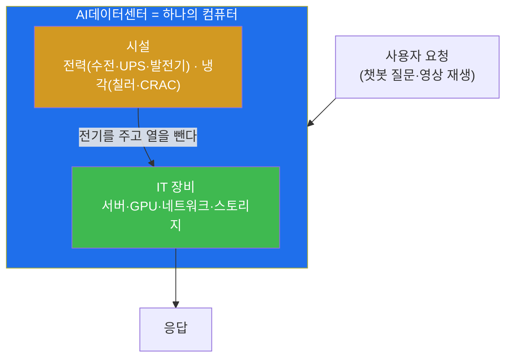
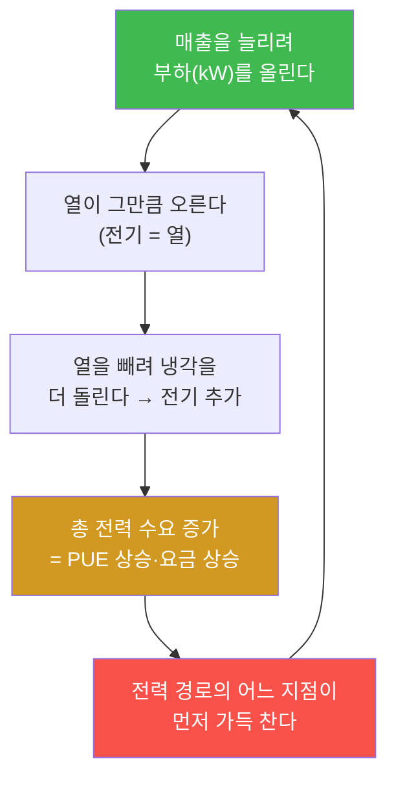
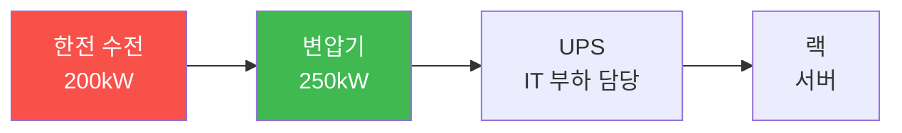

# 1주차 — AI데이터센터란 무엇인가: 건물이 컴퓨터다

> **이번 주 한 줄 요약.** AI 시대의 컴퓨터는 책상 위 한 대가 아니라 **건물 한 채**다.
> 이 과목은 그 건물을 '운영'하는 법을 한 학기에 한 바퀴 체험한다. 1주차에는 운영자가
> 매일 보는 세 숫자 — **kW·PUE·원** — 을 익히고, 데이터센터 타이쿤으로 그 숫자를
> 직접 만든다.

## 학습 목표
이번 주를 마치면 학생은 본인 손으로 다음을 할 수 있다.
1. "창고 규모 컴퓨터(WSC)"가 무엇이고 전통 서버실과 무엇이 다른지 한 문장으로 설명한다.
2. 운영자의 세 숫자 kW(전력)·PUE(냉각 효율)·원(비용)의 뜻과 관계를 말한다.
3. "모든 전기는 결국 열이 된다"는 원리로, 부하를 올리면 왜 전기가 두 번 드는지 설명한다.
4. 데이터센터 타이쿤을 실행해 첫 계약을 받고, 화면의 kW·PUE·손익 숫자를 읽는다.
5. 냉각 방식(CRAC vs 인로우)에 따라 PUE와 전기요금이 달라짐을 계산·검증한다.

---

## 0. 용어 해설 (이번 주 처음 나오는 말)

| 용어 | 영문 | 뜻 | 비유 |
|---|---|---|---|
| 데이터센터 | Data Center | 서버·네트워크·전력·냉각을 한 건물에 모아 IT 서비스를 돌리는 시설 | 도시의 발전소 겸 공장 |
| 창고 규모 컴퓨터 | WSC | 건물 전체를 **하나의 컴퓨터**처럼 설계·운영하는 방식 | 오케스트라(수천 대가 한 곡을 연주) |
| 부하 | Load (kW) | 서버가 지금 실제로 쓰는 전력. 클수록 일을 많이 한다 | 자동차 엔진 회전수 |
| PUE | Power Usage Effectiveness | (건물 총 전력) ÷ (IT가 쓴 전력). 1에 가까울수록 효율적 | 1L 주유해 실제 굴러간 거리 |
| SLA | Service Level Agreement | "몇 % 시간을 켜 두겠다"는 계약상 약속(예: 99.9%) | 배달 시간 약속 |
| 가용성 | Availability | 실제로 켜져 있던 시간의 비율 | 가게가 문 연 시간 비율 |

> **헷갈리기 쉬운 한 쌍 — 용량과 부하.** *용량(capacity)* 은 "최대 얼마까지"이고
> *부하(load)* 는 "지금 실제로 얼마"다. 10kW 랙(용량)에 지금 4kW가 돌면(부하) 6kW가
> 남는다. 운영은 이 둘의 간격을 보는 일이다.

---

## 1. 건물이 컴퓨터다

여러분이 챗봇에 질문을 하나 던지면, 그 답은 어느 노트북이 아니라 **어딘가의 데이터센터**
안 수천 대의 서버가 협력해 만들어 낸다. 검색, 유튜브, 지도, 그리고 요즘의 생성형 AI까지 —
현대의 서비스는 서버 한 대가 아니라 **건물 전체가 하나의 컴퓨터처럼** 동작해야 감당된다.
이 방식을 **창고 규모 컴퓨터(Warehouse-Scale Computer, WSC)** 라고 부른다.

전통적인 회사 서버실과 무엇이 다를까. 서버실은 서로 상관없는 장비를 편의상 한 방에
모아 둔 곳이다. WSC는 다르다. 수천 대가 **하나의 목적**을 위해, **공통의 전력·냉각·관리
체계** 아래, **하나의 기계처럼** 돌아간다. 그래서 우리는 이 건물을 "관리한다"가 아니라
**"운영한다(operate)"** 고 말한다 — 한 대의 거대한 컴퓨터를 켜 두는 일이기 때문이다.

**왜 이것이 이 디그리의 출발점인가.** AI데이터센터를 운영한다는 것은 이 두 세계 —
IT(초록)와 시설(주황) — 를 **한 사람이 한 화면에서** 읽는 일이다. 서버가 일을 많이 하면
전기를 많이 쓰고, 전기는 곧 열이 되어 냉각이 또 전기를 쓴다. 이 되먹임을 모르면 운영이
안 된다. 그래서 1주차는 이 두 세계를 잇는 **세 숫자**부터 시작한다.

---

## 2. 운영자의 세 숫자 — kW, PUE, 원

데이터센터 운영자의 하루는 대부분 세 종류의 숫자를 읽는 일이다.

### kW — 전력, 모든 것의 시작
서버가 하는 "일"의 양은 결국 **전력(kW, 킬로와트)** 으로 나타난다. 부하가 10kW라는 건
그 방의 IT 장비가 지금 10kW를 소비한다는 뜻이다. 수익을 내는 계약도 "몇 kW를 주세요"로
들어오고, 시설의 한계도 "몇 kW까지"로 정해진다. **kW는 운영의 공용어다.**

### PUE — 냉각까지 포함한 진짜 전기 사용량
IT 장비만 전기를 쓰는 게 아니다. 그 열을 빼는 냉각도, 배전 과정의 손실도 전기를 쓴다.
그래서 건물이 실제로 끌어다 쓴 총 전력을 IT가 쓴 전력으로 나눈 값을 **PUE**라 한다.

$$\text{PUE} = \frac{\text{건물 총 전력}}{\text{IT 전력}}$$

- PUE 1.0 = 이상적(냉각·손실이 0, 현실엔 없다)
- PUE 1.5 = IT가 10kW를 쓰면 건물은 15kW를 쓴다(냉각·손실에 5kW)
- PUE 2.0 = 절반이 냉각·손실로 나간다(나쁘다)

PUE는 냉각을 잘 설계했는지 보여 주는 **성적표**다. 뒤에서 보겠지만, 냉각 장비를 무엇으로
고르느냐, 바깥이 얼마나 더운가에 따라 PUE가 출렁인다.

### 원 — 결국 돈으로 만난다
kW도 PUE도 마지막엔 **돈(원)** 으로 정산된다. 전기요금은 대략 **1kWh에 165원**(산업용)이다.
그러면 **IT 1kW를 한 달(720시간) 켜 두면**:

$$1\,\text{kW} \times 720\,\text{h} \times 165\,\text{원} = 118{,}800\,\text{원}$$

여기에 PUE 1.5를 곱하면(냉각·손실까지 물면) **178,200원**이다. 이 숫자가 중요한 이유:
**계약 단가가 이보다 낮으면 그 서버는 켜 둘수록 손해**다. 실제로 타이쿤을 만들 때 처음엔
단가를 이보다 낮게 잡았다가 "무엇을 해도 망하는 게임"이 나왔다고 한다. 운영은 이 하한선
위에서 이루어진다.

---

## 3. 모든 전기는 결국 열이 된다

이 과목에서 딱 하나만 기억한다면 이 문장이다.

> **서버가 쓴 kW는 그대로 kW의 열이 되고, 그 열을 빼려면 또 전기가 든다.**

물리적으로 당연하다 — 전기 에너지는 사라지지 않고 대부분 열로 바뀐다. 그래서 데이터센터
운영에는 **되먹임 고리**가 생긴다.

이 고리 때문에 "부하를 올리면 전기가 두 번 든다" — 한 번은 IT가, 한 번은 그 열을 빼는
냉각이. 그리고 **냉각 방식에 따라 두 번째 전기의 크기가 다르다.** 냉각 효율은 **COP**
(Coefficient of Performance, 성능계수)로 나타내는데, "전기 1을 써서 열 몇을 빼는가"이다.
COP가 높을수록 같은 열을 적은 전기로 뺀다.

| 냉각 장비 | COP(온화한 날) | 뜻 |
|---|---|---|
| 항온항습기(CRAC) | 3.0 | 전기 1로 열 3을 뺀다. 흔하고 튼튼하지만 효율은 낮다 |
| 인로우(InRow) | 4.2 | 열원(랙) 바로 옆이라 같은 열을 적은 전기로 뺀다 |

실습에서 직접 확인하겠지만, 표준 랙 10kW를 CRAC으로 식히면 PUE가 약 **1.51**,
인로우로 바꾸면 약 **1.37**이 된다. 장비 하나 바꿨을 뿐인데 매달 전기요금이 **약 16.7만원**
차이 난다. 그리고 바깥이 **35℃로 더워지면** 같은 CRAC의 COP가 3.0에서 **1.92**로 떨어져
PUE가 **1.77**까지 튄다 — "여름에 요금이 튄다"가 바로 이것이다.

---

## 4. 용량은 경로의 각 지점에서 따로 성립한다

전기는 한 번에 서버로 가지 않는다. **수전 → 변압기 → UPS → 랙** 이라는 경로를 지난다.
여기서 운영자가 반드시 아는 원칙:

> **총합이 남아도, 경로의 한 지점이 모자라면 거기서 끊긴다.**

수전이 200kW, 변압기가 250kW면 실제 상한은 **둘 중 작은 200kW**다. 변압기를 아무리 키워도
수전이 200이면 소용없다. 이 200kW가 받쳐 줄 수 있는 IT 부하는 (냉각·손실을 포함하므로)
약 **138kW**다. 실무에서 증설 사고가 나는 자리가 정확히 여기다 — "총 용량은 남는데
왜 안 되지?"의 답이 이 그림에 있다.

> 참고: UPS(무정전 전원장치)는 **IT 부하만** 받친다. 냉각은 UPS 뒤가 아니라 발전기 뒤에
> 붙는다. 정전 순간 서버는 한 순간도 꺼지면 안 되지만, 냉각은 수십 초 멈춰도 실온이 잘
> 안 변하기 때문이다. (자세한 건 5~6주 시설 관제에서 다룬다.)

---

## 5. 왜 하필 '운영'인가

건물을 잘 짓는 것과 잘 운영하는 것은 다르다. 아무리 좋은 데이터센터라도 —
- 부하를 잘못 올려 방을 삶기면 계약이 죽고,
- 냉각을 잘못 골라 PUE가 높으면 매달 전기요금이 새고,
- 전력 경로 한 지점을 못 보면 증설하고도 서비스가 끊긴다.

이 판단들을 **매일, 실시간으로** 내리는 사람이 운영자다. 그리고 규모가 커질수록 이
판단은 사람 손을 떠나 자동화로 넘어간다(그 이야기가 10~11주 '운영 자동화'다). 이 과목은
그 전체를 한 바퀴 돌며, 여러분이 **어느 자리에서 무엇을 판단하는 사람이 되는지**를
체험하게 한다.

> **이 과목의 평가 철학.** 정답은 하나가 아니다. UPS를 절체할지, 어느 부하를 끊을지에
> 정해진 정답은 없다. 중요한 건 **"무엇을 지키기로 했고, 그 대가가 무엇인지"** 를 말할 수
> 있는 것이다. 모든 주차의 판단 기록을 이 기준으로 본다.

---

## 실습 안내 (이번 주 실습 = 타이쿤 첫 운영 + 세 숫자 읽기)

이번 주 실습([lab.md](lab.md))은 두 부분이다.
- **(가) 타이쿤 첫 운영** — 데이터센터 타이쿤을 열어 첫 계약을 받고, 화면의 kW·PUE·손익
  숫자를 직접 읽는다. "부하를 올리면 열이 오른다"를 눈으로 확인한다.
- **(나) 세 숫자 계산·검증** — CRAC vs 인로우, 겨울 vs 여름의 PUE와 전기요금을 손으로
  계산하고, 게임의 실제 물리 모형으로 **자동 검증**한다.

각 실습에서:
- **왜 하는가** — kW·PUE·원이라는 운영의 공용어를 몸으로 익힌다.
- **무엇을 아는가** — 냉각 선택과 바깥 기온이 요금을 어떻게 바꾸는지 숫자로 안다.
- **정상 vs 비정상** — PUE가 1.3~1.6이면 건강, 2.0에 가까우면 냉각 설계에 문제.
- **실전 활용** — 계약 단가가 전기요금 하한을 넘는지 판단하는 감각.

---

## 다음 주차 예고
2주차에는 이 건물의 속을 한 바퀴 돈다 — 전력(수전·UPS·발전기)과 냉각(칠러·CRAC),
서버와 네트워크가 각각 무슨 일을 하는지 개요를 잡고, 타이쿤에서 랙과 냉각을 직접
배치해 첫 방을 꾸민다.
