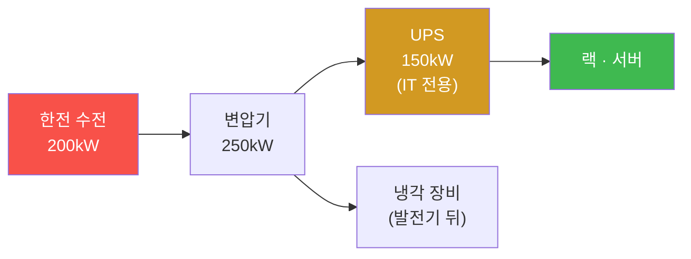
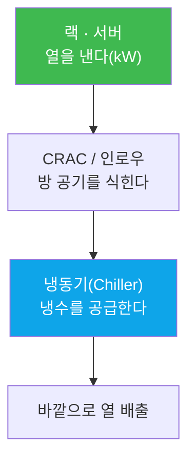

# 2주차 — 건물 속 한 바퀴: 전력·냉각·서버·네트워크

> **이번 주 한 줄 요약.** 1주차에 배운 세 숫자(kW·PUE·원)가 실제로 어떤 장비에서
> 나오는지, 데이터센터 건물 속을 한 바퀴 돈다. 전력이 들어와 서버까지 가는 길,
> 그 서버가 낸 열을 빼는 냉각의 길을 따라가며 각 장비의 역할을 잡고, 타이쿤에서
> **인수한 시설을 직접 늘려** 본다.

## 학습 목표
이번 주를 마치면 학생은 본인 손으로 다음을 할 수 있다.
1. 전력 경로(수전→변압기→UPS→랙)와 냉각 경로(냉동기→CRAC→랙)의 각 장비 역할을 말한다.
2. "용량은 총량이 아니라 경로의 각 지점에서 따로 성립한다"를 예로 설명한다.
3. 랙의 **용량(자리)** 과 **부하**, 그리고 **제열 여유**를 구분해 계산한다.
4. "랙에 자리가 있어도 열을 못 빼면 계약을 못 받는다"를 숫자로 보인다.
5. 타이쿤에서 인수한 시설의 병목 지점을 찾아 그 지점만 골라 증설한다.

---

## 0. 용어 해설

| 용어 | 영문 | 뜻 | 비유 |
|---|---|---|---|
| 수전 | Utility Feed | 한전에서 받아 오는 전력 용량 | 집으로 들어오는 수도 계량기 |
| 변압기 | Transformer | 받은 전기를 건물에서 쓸 전압으로 바꿔 배분 | 큰 관을 여러 가는 관으로 |
| UPS | 무정전 전원장치 | 정전 순간(초 단위)을 배터리로 메운다 | 노트북 배터리 |
| 발전기 | Generator | 정전이 길어질 때(시간 단위) 연료로 전기를 만든다 | 비상 발전차 |
| 냉동기 | Chiller | 냉각 장비(CRAC 등)에 냉수를 공급하는 큰 심장 | 중앙 에어컨 실외기 |
| CRAC | 항온항습기 | 방의 공기를 식히는 냉각 장비 | 방마다 있는 에어컨 |
| 랙 | Rack | 서버를 꽂는 19인치 표준 선반. capacityKw만큼 부하를 받는다 | 책을 꽂는 책장 |
| 제열(除熱) | Heat removal | 장비가 낸 열을 방 밖으로 빼내는 능력(kW) | 환풍 능력 |

> **헷갈리기 쉬운 세 낱말 — 용량·부하·여유.** *용량(capacity)* 은 최대치, *부하(load)* 는
> 지금 실제, *여유(headroom)* 는 용량 − 부하다. 랙에도, 냉각에도, 전력 경로에도 이
> 셋이 각각 있다. 운영은 **가장 먼저 여유가 0이 되는 지점**을 찾는 일이다.

---

## 1. 전력이 서버까지 가는 길

전기는 한 번에 서버로 가지 않는다. 네 관문을 지난다.

- **수전** — 바깥에서 얼마를 받아 오는가. 이걸 넘으면 아무것도 못 늘린다.
- **변압기** — 받은 걸 건물로 내린다. 여기가 좁으면 수전이 남아도 소용없다.
- **UPS** — 정전 **순간**을 메운다. 중요한 점: UPS는 **IT 부하만** 받친다. 냉각은 UPS 뒤가
  아니라 발전기 뒤에 붙는다. 서버는 한 순간도 꺼지면 안 되지만, 냉각은 수십 초 멈춰도
  실온이 잘 안 변하기 때문이다.
- **발전기** — 정전이 **길어지면** 이것뿐이다(연료가 있어야 한다).

**핵심 원칙(1주차 복습).** 총 용량이 남아도 **경로의 한 지점**이 모자라면 거기서 끊긴다.
실습에서 확인하겠지만, 인수한 시설(수전 200·변압기 250·UPS 150)에서 IT 부하의 실제 상한은
약 **136kW**이고, 그 병목은 놀랍게도 수전이 아니라 **UPS**다 — UPS가 150kW로 가장 작기
때문이다. "어느 지점이 먼저 차는가"를 읽는 것이 운영의 시작이다.

---

## 2. 서버가 낸 열을 빼는 길

서버가 쓴 전기는 그대로 열이 된다(1주차). 그 열을 빼는 것이 냉각 경로다.

- **CRAC/인로우** — 방 안의 열을 직접 식히는 장비. 각자 "몇 kW를 뺄 수 있다"는 제열 능력이 있다.
- **냉동기** — 그 CRAC들에 냉수를 공급하는 큰 심장. **이 용량이 모자라면 CRAC이 아무리
  많아도 못 뺀다** — 이것도 "경로의 한 지점" 원칙이다.

인수한 시설은 표준 랙 4대(**자리 40kW**)에 CRAC 2대(**제열 80kW**)가 붙어 있다. 자리보다
냉각이 넉넉한 건강한 출발이다.

---

## 3. 자리, 부하, 그리고 제열 여유

계약을 받는다는 것은 그 계약의 부하(kW)를 랙에 **올리는** 일이다. 여기에 두 개의 벽이 있다.

**벽 ① 랙 자리.** 표준 랙 4대면 자리가 40kW다. 40kW 계약을 받으면 랙이 꽉 찬다. 여기서
30kW를 더 받으려 하면 **자리가 없어 배치 자체가 실패**한다. 실무의 말로 "일감이 없어서가
아니라 자리가 없어서" 못 받는 상황이다. 더 받으려면 랙을 더 지어야 한다(표준 랙 1대 1,200만원).

**벽 ② 제열.** 자리를 넓혔다고 끝이 아니다. 고밀도 랙 4대로 **자리를 100kW**로 늘려도,
CRAC이 그대로 2대(**제열 80kW**)면 100kW를 올리는 순간 **20kW의 열이 안 빠진다**. 제열
여유가 −20kW, 즉 음수가 되고 방 온도가 오르기 시작한다.

$$\text{제열 여유} = (\text{냉각 능력}) - (\text{올라간 부하}) = 80 - 100 = -20\,\text{kW}$$

> **이 과목에서 두 번째로 중요한 문장.**
> **"랙에 자리가 있다고 받을 수 있는 것이 아니다. 열을 뺄 수 있어야 받는 것이다."**
> 게임은 이런 계약을 막지 않는다 — 받을지 말지는 운영자의 판단이다. 다만 "제열 여유가
> 20kW 모자란다"고 알려는 준다. 모르고 지나가지 않게.

---

## 4. 증설은 '막힌 지점'을 고르는 일

시설을 키운다는 건 무턱대고 다 사는 게 아니라, **가장 먼저 여유가 0이 된 지점**을 골라
그것만 늘리는 것이다. 무엇을 얼마에 늘릴 수 있는지(실단위):

| 늘리는 것 | 효과 | 비용 |
|---|---|---|
| 표준 랙 | +10kW 자리 | 1,200만원 |
| CRAC / 인로우 | +40 / +35kW 제열 | 3,000만 / 3,800만원 |
| 수전 | +200kW | 4,000만원 |
| 변압기 | +250kW | 6,000만원 |
| UPS | +150kW(IT) | 8,000만원 |
| 냉동기 | +250kW 냉수 | 9,000만원 |
| 발전기 | +300kW | 1억 4,000만원 |
| 다음 층 개설 | 새 바닥 | 1억 8,000만원(2층) |

예를 들어 UPS가 병목(136kW)이라면, 수전을 늘려도 소용없다. UPS를 하나 더 사야
IT 상한이 올라간다. **어느 표를 보고 무엇을 살지 정하는 것이 증설 판단**이고, 이 판단이
5주차 이후 관제로 이어진다.

---

## 실습 안내 (이번 주 실습 = 인수한 시설 파악 + 증설 판단)

이번 주 실습([lab.md](lab.md))은 두 부분이다.
- **(가) 타이쿤 — 인수한 시설 한 바퀴.** 게임을 열어 물려받은 시설의 랙·냉각·전력 용량을
  직접 확인하고, 계약을 받아 부하를 올려 본다. 자리와 제열의 벽을 눈으로 만난다.
- **(나) 계산·검증.** 스타터 시설의 용량, 전력 경로 병목(어느 장비가 상한을 정하나),
  제열 여유가 음수가 되는 조건을 손으로 따지고 게임 모형으로 **자동 검증**한다.

각 실습에서:
- **왜 하는가** — 용량·부하·여유를 경로의 각 지점에서 읽는 습관을 들인다.
- **무엇을 아는가** — 왜 총량이 남아도 서비스가 끊기는지, 어디를 늘려야 하는지.
- **정상 vs 비정상** — 제열 여유가 양수면 건강, 음수면 온도 상승(비정상).
- **실전 활용** — "증설 사고"의 대부분이 경로의 한 지점을 못 본 데서 온다.

---

## 다음 주차 예고
3주차에는 이 건물이 **무엇을 굴리는지** — AI/LLM 워크로드 — 를 다룬다. LLM이 무엇이고,
학습과 추론이 시설(전력밀도·냉각·GPU)에 어떤 부담을 요구하는지 잡고, 타이쿤에서 GPU
계약이 왜 액랭(CDU)을 먼저 요구하는지 확인한다.
