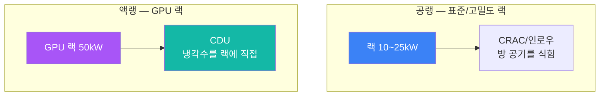
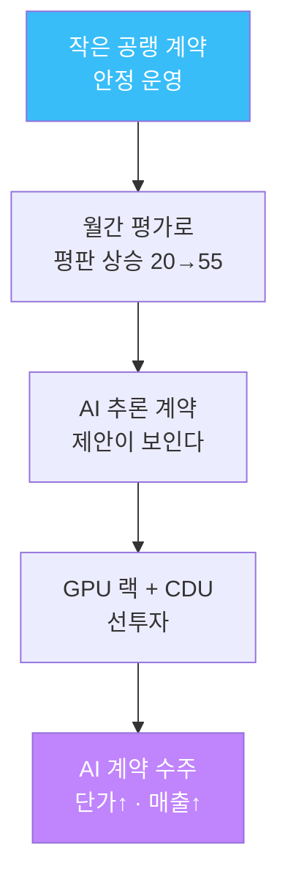

# 3주차 — 무엇을 운영하나: AI/LLM 워크로드가 시설에 요구하는 것

> **이번 주 한 줄 요약.** 지금까지는 '건물'을 봤다. 이번 주는 그 건물이 **무엇을 굴리는지**
> — AI/LLM 워크로드 — 를 본다. LLM이 무엇이고, 학습과 추론이 무엇이 다르며, 왜 AI
> 워크로드가 GPU·액랭(CDU)·높은 전력밀도를 요구하는지 잡는다. 타이쿤에서 GPU 계약이
> 왜 **액랭을 먼저** 요구하는지 직접 확인한다.

## 학습 목표
1. LLM이 무엇인지(다음 단어 예측)와 학습(training)·추론(inference)의 차이를 설명한다.
2. AI 워크로드가 시설에 요구하는 것(전력밀도·GPU·냉각)을 1~2주차 개념과 연결한다.
3. GPU 랙의 전력밀도가 표준 랙의 몇 배인지, 왜 공랭으로 못 빼는지 설명한다.
4. 액랭(CDU)이 왜 GPU 랙보다 먼저 있어야 하는지, 액랭이 왜 PUE를 낮추는지 계산한다.
5. AI 계약이 냉각(액랭)과 평판이라는 두 문턱을 넘어야 받아지는 것을 타이쿤으로 확인한다.

---

## 0. 용어 해설

| 용어 | 영문 | 뜻 | 비유 |
|---|---|---|---|
| LLM | Large Language Model | 방대한 텍스트로 훈련해 "다음 단어"를 예측하는 초대형 신경망 | 문장을 끝없이 이어 쓰는 기계 |
| 학습 | Training | 모델을 만드는 단계. 수천 개 GPU가 몇 주씩 돈다 | 시험 대비 벼락치기(길고 무겁다) |
| 추론 | Inference | 만들어진 모델을 실제로 쓰는 단계(질문에 답) | 시험장에서 답하기(짧고 잦다) |
| GPU | Graphics Processing Unit | 행렬 연산을 대량 병렬로 처리하는 칩. AI 연산의 주력 | 수천 명이 동시에 계산 |
| 전력밀도 | Power density | 같은 바닥 면적(랙 한 칸)이 쓰는 전력(kW) | 한 평에 몇 명이 앉나 |
| 액랭 | Liquid cooling | 냉각수를 랙/칩 가까이 흘려 열을 빼는 방식. 고밀도에 필수 | 공랭=선풍기, 액랭=수랭 PC |
| CDU | Coolant Distribution Unit | 액랭용 냉각수를 분배하는 장치. serves='liquid' | 수랭 배관의 펌프·분배기 |

---

## 1. LLM이란 무엇인가 (아주 짧게)

이 과목은 LLM을 **만드는** 과목이 아니라 **운영하는** 과목이다. 그래서 딱 필요한 만큼만 본다.

**LLM의 본질은 하나다 — "지금까지의 글 다음에 올 단어를 예측한다."** "나는 아침에
일어나서 이를 ___"에서 "닦았다"가 올 확률이 높다고 판단하는 것이다. 이 단순한 과제를
인터넷 규모의 텍스트로 수없이 연습하면, 번역·요약·질의응답·코드 생성 같은 능력이 함께
생겨난다. 챗봇이 답을 한 글자씩 타이핑하듯 내놓는 건 실제로 **한 토큰씩** 예측하고 있기
때문이다.

운영자가 기억할 두 단계:
- **학습(training)** — 모델을 만드는 과정. **수천 개 GPU가 몇 주** 돈다. 전력도 열도
  한 건으로 뒤집힌다. 타이쿤의 `AI 학습 클러스터` 계약(90~200kW)이 이것이다.
- **추론(inference)** — 만든 모델을 서비스로 쓰는 과정. 학습보다 가볍지만 **끊임없이**
  들어온다. 타이쿤의 `AI 추론 서비스` 계약(40~90kW)이 이것이다.

> 왜 운영자가 이걸 알아야 하나? **워크로드가 시설을 정하기 때문이다.** 학습이냐 추론이냐에
> 따라 필요한 전력·GPU 수·냉각이 달라지고, 그게 곧 여러분이 관리할 부하와 열이 된다.

---

## 2. AI 워크로드는 '밀도'가 다르다

AI 연산은 GPU에 몰린다. 그래서 같은 바닥 한 칸(랙)이 내는 열이 훨씬 크다 —
**전력밀도**가 높다.

| 랙 종류 | 한 칸 용량 | 냉각 | 표준 대비 |
|---|---|---|---|
| 표준 랙 | 10kW | 공랭 | ×1 |
| 고밀도 랙 | 25kW | 공랭(한계 근처) | ×2.5 |
| **GPU 랙** | **50kW** | **액랭** | **×5** |

GPU 랙 한 칸은 표준 랙 **5배**의 열을 낸다. 공기로는 이 밀도의 열을 빼기 어렵다. 그래서
**액랭(CDU)** 이 등장한다 — 냉각수를 랙/칩 가까이 흘려 열을 직접 실어 나른다.

---

## 3. 왜 GPU 랙은 액랭이 '먼저' 있어야 하나

타이쿤은 이 물리를 규칙으로 강제한다. **GPU 랙은 같은 층에 CDU가 없으면 아예 설치되지
않는다** ("같은 층에 액랭 분배장치(CDU)가 먼저 있어야 한다"). 물이 랙 안으로 들어가야
그 밀도를 감당할 수 있기 때문이다. 순서가 있다 — **CDU(냉각) 먼저, GPU 랙(부하) 나중.**

그리고 공랭과 액랭은 **섞이지 않는다.** AI 계약(`needs: liquid`)은 액랭 랙에만 올라가고,
공랭 계약(`needs: air`)은 공랭 랙에만 올라간다. 공랭 랙만 있는 방에 AI 계약을 배치하려
하면 실패한다. 즉 **AI 계약을 받으려면 그 전에 GPU 랙 + CDU를 갖춰 둬야 한다.**

이것이 1~2주차의 "열을 뺄 수 있어야 받는다"의 AI 버전이다 — AI는 열을 빼는 방식 자체가
다르고, 그 방식을 먼저 준비해야 한다.

---

## 4. 액랭은 오히려 PUE를 낮춘다

액랭이 비싸 보이지만(CDU 1억 2천만원), 효율은 훨씬 좋다. 냉각 효율(COP)을 비교하면:

| 냉각 | COP(온화한 날) | 전기 1로 빼는 열 |
|---|---|---|
| CRAC(공랭) | 3.0 | 3 |
| 인로우(공랭) | 4.2 | 4.2 |
| **CDU(액랭)** | **8.0** | **8** |

실습에서 검증하겠지만, **GPU 랙 50kW를 CDU로 식히면 PUE가 약 1.21**이다. 냉각에 쓰는
전기가 약 **8.1kW**뿐이다. 같은 양의 열(약 54kW)을 공랭 CRAC(COP 3.0)으로 뺀다면
냉각에만 **약 18kW**가 든다 — 2배가 넘는다.

$$\text{냉각 전기}=\frac{\text{뺄 열}}{\text{COP}}\;\Rightarrow\;\frac{54}{8.0}\approx 6.75 \text{ vs } \frac{54}{3.0}=18$$

> **핵심.** 고밀도 AI 워크로드일수록 액랭은 **선택이 아니라 필수이자 이득**이다. 그래서
> 세계의 AI 데이터센터가 빠르게 액랭으로 가고 있다. 여러분이 운영할 데이터센터의 미래가
> 이 방향이다.

---

## 5. AI 계약은 두 문턱을 넘어야 온다

타이쿤에서 AI 계약은 아무 때나 오지 않는다. **두 개의 문턱**이 있다.

1. **냉각 문턱** — 액랭(GPU 랙 + CDU)이 있어야 배치된다(§3).
2. **평판 문턱** — AI 추론은 평판 **55**, AI 학습은 **70** 이상이어야 제안조차 뜬다.
   시작 평판은 20이라, 처음엔 제안 목록에 **웹 호스팅과 기간계 DB만** 보인다.

평판은 운영을 잘한 달에 오른다(월간 무장애 운영 평가). 즉 **작은 공랭 계약을 안정적으로
운영해 평판을 쌓아야, 비로소 단가 높은 AI 계약이 보이고, 그때 GPU·액랭에 투자할
명분이 생긴다.** 이 순서가 이 게임(그리고 실제 사업)의 성장 경로다.

---

## 실습 안내 (이번 주 실습 = AI 워크로드의 제약을 몸으로)

이번 주 실습([lab.md](lab.md))은 두 부분이다.
- **(가) 타이쿤 — AI로 가는 길.** GPU 랙을 지으려다 CDU 요구에 막혀 보고, CDU→GPU 순서로
  갖춘 뒤, 평판이 낮아 AI 계약이 안 보이는 것을 확인한다.
- **(나) 계산·검증.** GPU 전력밀도, 액랭의 낮은 PUE, 평판·냉각 게이트를 손으로 따지고
  게임 모형으로 **자동 검증**한다.

각 실습에서:
- **왜 하는가** — 워크로드가 시설을 어떻게 정하는지 체감한다.
- **무엇을 아는가** — AI 계약을 받으려면 무엇을 어떤 순서로 준비해야 하는지.
- **정상 vs 비정상** — GPU 방 PUE가 1.2대면 건강(액랭 효율), 공랭으로 무리하면 급등.
- **실전 활용** — 실제 AI 데이터센터가 왜 액랭·고밀도로 가는지의 근거.

---

## 다음 주차 예고
4주차에는 이 모든 것이 **돈**으로 어떻게 만나는지 본다 — PUE와 TCO(총소유비용). 왜
사용률이 비용을 좌우하는지, 여름 폭염이 왜 요금을 튀게 하는지를 타이쿤 손익표로 읽는다.
