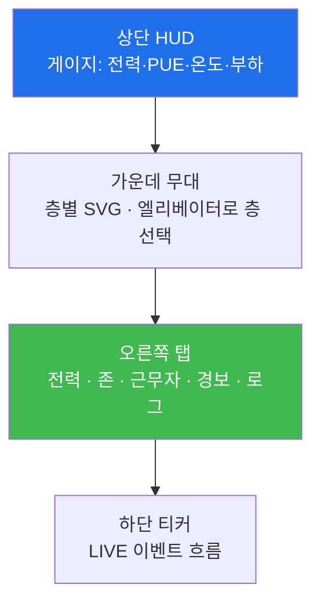
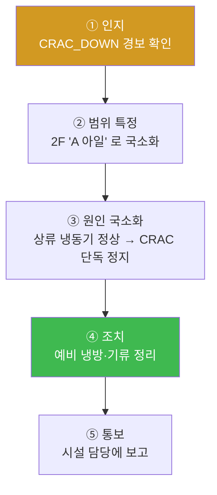

# 5주차 — 관제실에 앉다: NOC 콘솔과 첫 고장 대응

> **이번 주 한 줄 요약.** 이해 구간(1~4주)이 끝났다. 이제 **관제실(NOC)** 에 앉는다.
> kt66 NOC 콘솔의 게이지·경보·로그를 읽는 법을 익히고, SLA(탐지·조치)의 뜻을 잡은 뒤,
> 강사가 발사하는 **첫 고장(항온항습기 1대 정지)** 에 트리아지 절차로 대응한다.
> '이해하는' 사람에서 '돌리는' 사람으로 넘어가는 첫 주다.

## 학습 목표
1. NOC 콘솔의 구성(게이지·존·경보·로그·근무자)을 읽고 정상/이상을 판별한다.
2. SLA의 두 시계 — 탐지(detect)·조치(mitigate) — 의 뜻과 시작점을 설명한다.
3. 고장 대응의 트리아지 5단계(인지→범위→원인 국소화→조치→통보)를 수행한다.
4. "냉방은 랙이 아니라 아일 단위"라는 원리로 영향 범위를 정확히 특정한다.
5. 범위를 너무 넓게 잡는 것(전층 차단)이 왜 금지 행위인지 설명한다.

---

## 0. 용어 해설

| 용어 | 영문 | 뜻 |
|---|---|---|
| NOC | Network/Ops Operations Center | 데이터센터를 실시간 감시·대응하는 관제실 |
| 경보 | Alarm | 이상 상태를 알리는 신호. 등급(level)이 있다 |
| 트리아지 | Triage | 밀려드는 경보를 빠르게 분류·우선순위화하는 1차 판단 |
| SLA 탐지 | Detect SLA | 고장을 **알아챌 때까지** 허용 시간(예: 5분) |
| SLA 조치 | Mitigate SLA | 고장을 **완화할 때까지** 허용 시간(예: 15분) |
| 아일 | Aisle | 랙들이 마주 보고 늘어선 한 '통로' 단위. 냉방의 기본 단위 |
| 국소화 | Localization | 원인·영향을 가능한 좁은 범위로 좁혀 특정하는 것 |
| SIEM | Security Info & Event Mgmt | 흩어진 로그·경보를 한곳에 모으는 시스템 |

---

## 1. NOC 콘솔 한 바퀴 (kt66 :8020)

kt66 NOC는 미니 AI데이터센터의 관제 화면이다. 크게 다섯 곳을 본다.

- **게이지(HUD)** — 지금 이 순간의 전력·PUE·온도·부하. 1~4주에 배운 숫자가 여기 실시간으로 뜬다.
- **무대** — 층(1F~4F)을 엘리베이터 패널로 오가며 장비 배치를 본다. 고장 난 장비는 색이 바뀐다.
- **탭** — 전력/존/근무자/**경보**/로그. 경보 탭에 빨간 배지가 뜨면 무언가 났다는 뜻.
- **강사 패널** — 강사가 고장 **48종**(시설 10 + IT 38)을 주입한다. 주입 즉시 **SIEM으로
  syslog가 나간다** — 학생 화면과 같은 사건이 보안관제 도구로도 흘러든다(다른 과목과의 접점).

> **관제의 첫 습관.** 화면을 켜면 가장 먼저 게이지가 **평소 범위**인지 훑는다. 온도 22℃
> 근처, PUE 1.3~1.6, 부하가 계약과 맞는지. 이 '평시 감각'이 있어야 이상을 알아챈다.

---

## 2. SLA — 두 개의 시계

고장 대응은 두 개의 시계로 평가된다.

- **탐지 SLA(detect)** — 고장이 난 순간부터 **운영자가 알아챌 때까지**. ENV-CRAC-01은 **5분**.
- **조치 SLA(mitigate)** — 고장 순간부터 **완화 조치를 낼 때까지**. ENV-CRAC-01은 **15분**.

중요한 점: 두 시계는 **경보가 뜬 시각이 아니라 학생이 인지·조치를 보고한 시각**으로 잰다.
"시뮬레이터가 경보를 띄운 것"은 성취가 아니다. **여러분이 그것을 읽고 판단한 것**이 성취다.
그래서 채점도 여러분이 남긴 기록(증거)으로 한다.

---

## 3. 트리아지 5단계 — 첫 고장에 이렇게 대응한다

이번 주 첫 고장은 **ENV-CRAC-01 — 항온항습기(CRAC) 1대 정지(입문)**다. 2F A 아일의
CRAC A가 멈췄다는 경보가 뜬다. 대응은 다섯 단계를 밟는다.

| 단계 | 무엇을 | 왜 (배점) |
|---|---|---|
| ① 인지 | CRAC_DOWN 경보를 봤다고 기록 | 알아챘는가 (20) |
| ② 범위 특정 | 영향은 **2F A 아일**에 국한 | 이 시나리오의 목표 (30) |
| ③ 원인 국소화 | 상류 냉동기·플랜트는 정상, CRAC **단독** 정지 | 원인을 좁혔는가 (20) |
| ④ 조치 | 예비 냉방 가동/기류 정리 등 | 조치했는가 (20) |
| ⑤ 통보 | 시설 담당에 통보·보고 | 알렸는가 (10) |

이 다섯을 제대로 남기면 **100점**이다(강사·조교가 실제 시나리오 콘솔로 돌려 만점을 확인했다 —
[검증 상태](lab.md) 참조).

---

## 4. 이번 주의 핵심 통찰 — "냉방은 랙이 아니라 아일 단위"

왜 ②번(범위 특정)이 30점으로 가장 무거울까? **냉방은 랙 하나가 아니라 아일 단위로
작동하기 때문**이다. CRAC A가 멈추면 영향받는 건 "2F 전체"가 아니라 그 CRAC이 맡던
**A 아일**뿐이다. B·C 아일은 멀쩡하다.

여기서 두 가지 실수가 갈린다.
- **범위를 너무 넓게 잡으면** → "2F 전체 부하 차단" 같은 **과잉 대응**. 멀쩡한 아일의
  서비스까지 죽인다. 그래서 이건 **금지 행위**로 표시된다(점수를 깎진 않지만 강사가 본다).
- **범위를 너무 좁게 잡으면** → 같은 아일의 옆 랙이 함께 더워지는 걸 놓친다.

정확히 **A 아일**로 특정하는 것 — 이 균형이 이 시나리오가 가르치는 전부다. 그리고 이것이
관제의 본질이다: **정확한 범위에, 정확한 조치를.**

> **관제의 판단 철학(전 주차 공통).** 부하를 차단할지, 어디까지 끊을지에 유일한 정답은
> 없다. 중요한 건 **"무엇을 지키기로 했고 그 대가가 무엇인지"** 를 근거로 남기는 것이다.
> 그래서 채점도 "무엇을 했는가"보다 **"근거를 남겼는가"** 를 본다.

---

## 실습 안내 (이번 주 실습 = NOC 투어 + 첫 고장 대응)

이번 주 실습([lab.md](lab.md))은 두 부분이다.
- **(가) NOC 콘솔 투어.** kt66 NOC(:8020)를 열어 게이지·경보·로그·근무자 탭을 둘러보고,
  강사 패널로 고장을 스스로 주입해 화면이 어떻게 반응하는지 관찰한다(탐색용).
- **(나) 첫 고장 대응(ENV-CRAC-01).** 강사가 시나리오 콘솔(:8040)로 고장을 발사하면,
  트리아지 5단계로 대응하고 각 단계를 근거와 함께 기록(증거 제출)한다. 채점은 자동.

각 실습에서:
- **왜 하는가** — 경보에서 원인·범위로 좁혀 가는 관제의 기본 루프를 몸에 익힌다.
- **무엇을 아는가** — SLA 안에 인지·조치하는 리듬, 아일 단위 사고.
- **정상 vs 비정상** — A 아일 온도만 오르면 정상적 국소 고장, 2F 전체가 오르면 다른 원인.
- **실전 활용** — 첫 고장 대응이 이후 모든 관제(복합 장애·서비스 운영)의 축소판이다.

---

## 다음 주차 예고
6주차에는 고장의 종류를 넓힌다 — 전력·냉각의 대표 고장들과, 정답이 하나가 아닌
**판단 훈련**(UPS 절체·부하 차단: 무엇을 지키고 무엇을 버릴 것인가). 시설 관제 체험을
마무리한다.
