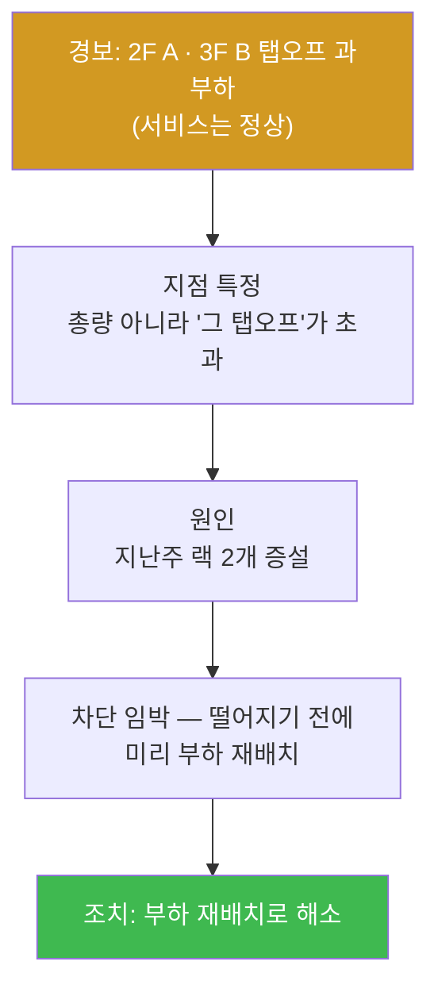
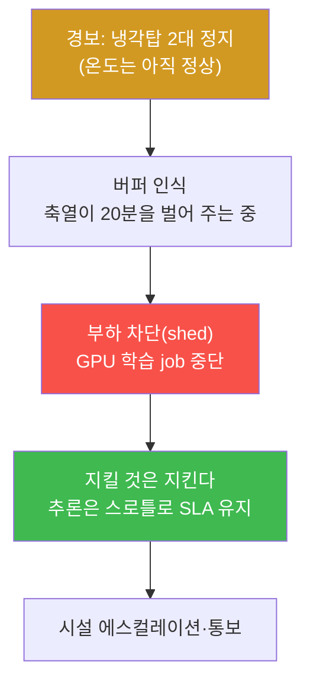

# 6주차 — 판단 훈련: 정상으로 보여도 여유는 줄고 있다

> **이번 주 한 줄 요약.** 5주차의 첫 고장은 "고쳐라"였다. 이번 주 고장들은 **"무엇을
> 지키고 무엇을 버릴 것인가"** 를 묻는다. 전력(부스바 과부하)과 냉각(냉각탑 정지)의
> 대표 고장을 통해, 아직 아무것도 안 죽었는데도 **여유(버퍼)가 조용히 소진되는** 상황에서
> 부하 차단·우선순위 판단을 훈련한다. 체험① 시설 관제의 마무리다.

## 학습 목표
1. "정상으로 보이는 것이 안전하다는 뜻은 아니다"를 두 고장 사례로 설명한다.
2. 전력 용량이 경로의 각 지점(부스바·탭오프)에서 따로 성립함을 관제 상황에서 적용한다.
3. 냉각 버퍼(축열)가 벌어 준 시간을 인식하고, 그 시간 안에 부하를 차단(shed)한다.
4. 무엇을 지키고 무엇을 버릴지(추론 SLA vs 학습 job) 우선순위 판단을 근거와 함께 남긴다.
5. "정상이므로 관망"이 왜 금지 행위인지 설명한다.

---

## 0. 용어 해설

| 용어 | 영문 | 뜻 |
|---|---|---|
| 부스바 | Busbar | 변압기에서 받은 전기를 층·계통으로 나르는 굵은 도체 |
| 탭오프 | Tap-off | 부스바에서 갈라져 PDU/랙으로 내려가는 분기 지점 |
| PDU | Power Distribution Unit | 랙에 전원을 나눠 주는 분전 장치 |
| UPS 런타임 | Runtime | 지금 부하로 UPS가 버틸 수 있는 시간(부하가 크면 짧아진다) |
| 축열 | Thermal buffer | 냉수를 저장해 냉각이 멈춰도 잠시 온도를 잡아 주는 열용량 |
| 부하 차단 | Load shedding | 덜 중요한 부하를 꺼서 전력·열을 줄이는 조치 |
| 절체 | Transfer | 전원 계통을 다른 경로(예: 상용→발전기)로 옮기는 것 |

---

## 1. 이번 주를 관통하는 한 문장

5주차의 CRAC 고장은 온도가 곧 올라 눈에 보였다. 이번 주 고장들은 다르다. **경보는 떴는데
아직 아무것도 안 죽었다.** 서비스는 정상, 온도도 정상. 그래서 "괜찮아 보인다." 바로 그것이 함정이다.

> **이번 주에 기억할 문장.**
> **"정상으로 보이는 것이 안전하다는 뜻이 아니다. 그 사이에 여유가 조용히 소진되고 있다."**

관제의 성패는 이 조용한 소진을 **증상이 나타나기 전에** 읽어내는 데 있다. 그리고 그때
내리는 판단이 "무엇을 지키고 무엇을 버릴 것인가"다.

---

## 2. 전력 대표 고장 — 부스바 과부하 (PWR-BUS-01)

**상황.** 2F A 계통과 3F B 계통에서 부스바 탭오프 과부하 경보가 떴다. 아직 차단되지
않았고 서비스도 정상이다. **지난주에 랙을 두 개 늘렸다.**

**핵심.** 전력 용량은 총량이 아니라 **경로의 각 지점**에서 따로 성립한다(2주차 병목의
관제 버전). 수전→변압기→부스바→탭오프→PDU→랙으로 내려오며 각 단계에 정격이 있고,
가장 작은 것이 실제 한계다. **"전체 용량은 남으니 괜찮다"** 가 바로 증설 사고의 전형적
경로다. 지난주 증설이 특정 탭오프를 정격 위로 밀어 올린 것이다.

**금지 행위.** "전체 용량은 여유가 있으므로 문제 없다", "차단되면(후에) 조치한다" —
둘 다 이 시나리오가 잡으려는 바로 그 오판이다.

---

## 3. 냉각 대표 고장 — 냉각탑 정지 (ENV-CT-01)

**상황.** 1F 기계 야드에서 냉각탑 2대가 동시에 멈췄다. **전산실 온도계는 아직 정상**이다.

**핵심.** 경보와 증상 사이에 약 **20분의 공백**이 있다. 이 공백은 정상이 아니라
**축열탱크가 빚을 대신 갚고 있는 시간**이다. 온도가 아직 정상이라는 이유로 대응을 미루면,
남은 시간을 다 쓰고 나서야 시작하게 된다. 그래서 이 20분 안에 **부하를 차단(shed)** 해
열 유입을 줄여야 한다.

여기서 "무엇을 지키고 무엇을 버릴 것인가"가 나온다. GPU **학습(training) job**은
중단해도 나중에 이어서 하면 되지만, GPU **추론(inference)** 은 사용자 SLA가 걸려 있다.
그래서 **학습을 버리고(중단) 추론을 지킨다(스로틀로 유지)** 는 우선순위 판단이 정답에 가깝다.

**금지 행위.** "온도 정상이라 대기/관망/지켜본다", "경보를 오탐으로 무시" — 버퍼가
빚을 갚는 시간을 흘려보내는 판단이다.

---

## 4. UPS 절체와 부하 차단 — "무엇을 지키고 무엇을 버릴 것인가"

두 고장이 공유하는 판단 프레임이 있다. NOC의 **UPS 절체 모달**이 그것을 한 문장으로 말한다.

> **"정답은 하나가 아니다. 무엇을 지키기로 했고 그 대가가 무엇인지 말할 수 있으면 된다."**

정전이 나면(참고: TL-BLACKOUT-01, 난이도 5) 발전기가 돌고 UPS가 버틴다. 겉보기엔
"복구된 것" 같지만 아니다. 시간이 갈수록 **남은 시간이 아니라 선택지가 줄어든다** —
초기엔 계획적 축소가 가능하고, 나중엔 우선순위 차단만 가능하고, 더 지나면 **사람이 먼저**
(대피·인명)가 된다. 그래서 **초기 판단의 값이 가장 크다.**

부하 차단의 원칙(2주차 shedding 로직과 같은 뿌리):
- **단가·중요도가 높은 것부터 지키고, 낮은 것부터 끊는다.**
- **끊은 것은 되돌릴 수 있어야 한다** — 증설·복전되면 자동 복귀.
- **무엇을 왜 끊었는지 기록**한다. 근거 없는 차단은 사고 때 판단을 늦춘다.

---

## 실습 안내 (이번 주 실습 = 판단형 고장 2종 + 부하 차단 판단)

이번 주 실습([lab.md](lab.md))은 두 고장에 트리아지+판단으로 대응한다.
- **PWR-BUS-01** — 지점 특정 → 원인(증설) → **차단 전에** 부하 재배치.
- **ENV-CT-01** — 버퍼(축열) 인식 → **부하 차단(학습 중단)** → 추론 SLA는 지킨다 → 통보.

각 실습에서:
- **왜 하는가** — "정상으로 보이는 위험"을 증상 전에 읽고 우선순위를 정하는 훈련.
- **무엇을 아는가** — 경로 지점별 정격, 냉각 버퍼, 부하 차단의 우선순위.
- **정상 vs 비정상** — 경보는 떴는데 증상이 없을 때가 가장 위험(여유 소진 중).
- **실전 활용** — 대형 사고(정전·복합 장애)의 초기 판단이 곧 이 판단의 확장.

> 판단 기록이 이번 주 평가의 핵심이다: **무엇을 지키기로 했고 그 대가가 무엇이었나.**

---

## 다음 주차 예고
7주차는 **체험②로 넘어가는 다리** — 지금까지의 시설 관제를 중간 점검(개념 퀴즈 + 관제
미니 실기)하고, 다음 구간(AI 서비스 운영, LLMOps)의 문을 연다.
