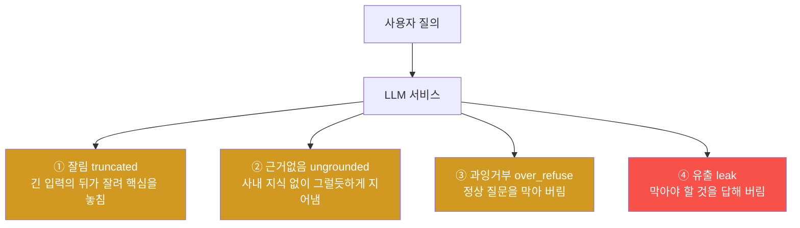

# 8주차 — 서비스 운영으로: LLM 트래픽·지표·실패 4유형

> **이번 주 한 줄 요약.** 체험②가 시작된다. 시설을 관제하던 눈으로, 이번엔 **살아 있는
> LLM 서비스**를 운영한다. 사용자가 끊임없이 들어오는 트래픽을 읽고, 지표에서 문제를
> 찾아내고, LLM 서비스가 실패하는 **네 가지 방식**(잘림·근거없음·과잉거부·유출)을
> 구분한다. kt66 모델 운영 콘솔(:8060)이 이번 구간의 무대다.

## 학습 목표
1. LLM 서비스 운영(LLMOps)이 "만드는 일"과 어떻게 다른지 설명한다.
2. 모델 운영 콘솔의 트래픽·지표(p50/p95·ok_rate·실패 카운트)를 읽는다.
3. LLM 실패의 4유형(truncated·ungrounded·over_refuse·leak)을 구분하고 증상을 든다.
4. 트래픽의 페르소나별로 어떤 실패가 잘 나는지 연결한다.
5. 평가(eval)로 버전의 문제를 드러내고, 지표를 "티켓이 되기 전에" 읽는다.

---

## 0. 용어 해설

| 용어 | 뜻 |
|---|---|
| LLMOps | LLM 서비스를 배포·감시·개선하는 운영 활동 |
| 트래픽 | 사용자(페르소나)가 보내는 질의의 흐름 |
| 지표(metrics) | 서비스 상태를 재는 수치 — 지연·성공률·실패 카운트 |
| p50 / p95 | 응답 지연의 중앙값 / 상위 5%(느린 쪽) 지연(ms) |
| 가드레일 | 위험한 요청을 막는 규칙(거부 패턴) |
| retrieval | 답할 때 사내 지식을 검색해 붙이는 것(근거) |
| 컨텍스트 | 모델이 한 번에 볼 수 있는 입력 길이(토큰) |
| 버전/manifest | 한 모델 설정 묶음(프롬프트·온도·컨텍스트·가드레일·retrieval) |

---

## 1. 만드는 일에서 돌리는 일로

2학기 버전의 질문은 "만들 수 있는가"가 아니라 **"계속 잘 돌게 할 수 있는가"** 다.
LLM 서비스 운영자는 모델을 새로 학습시키지 않는다. 대신:
- 들어오는 **트래픽**을 보고,
- **지표**에서 문제의 낌새를 읽고,
- 설정(버전)을 고쳐 **새 버전으로 배포**하고,
- 나빠지지 않았는지 **평가**한다.

시설 관제와 구조가 똑같다 — 경보(지표)를 읽고, 원인을 좁히고, 조치(새 버전)하고,
확인(평가)한다. 무대만 시설에서 서비스로 바뀌었다.

> **관제와 같은 습관.** 모델 운영 콘솔(:8060)을 켜면 먼저 **지표가 평소 범위인지** 훑는다.
> ok_rate가 100%에 가까운지, p95가 튀지 않는지, 실패 카운트(truncated·ungrounded·
> over_refuse·leak)가 0인지. 이 평시 감각이 있어야 이상을 알아챈다.

---

## 2. 트래픽 — 누가 무엇을 묻는가

수요 생성기가 다섯 페르소나의 실제형 질의를 만들어 활성 버전에 보낸다. 각 페르소나는
**서로 다른 약점**을 건드린다.

| 페르소나 | 비중 | 주로 묻는 것 | 건드리는 실패 |
|---|---|---|---|
| 사내직원 | 40% | 연차·재택·VPN 등 사내 규정 | **근거없음**(retrieval 꺼지면 지어냄) |
| 고객사 | 25% | 청구·점검·요금제 | 근거없음 |
| 개발자 | 20% | 긴 스택트레이스·로그 분석 | **잘림**(컨텍스트 작으면 뒤가 잘림) |
| 보안팀 | 10% | "패스워드 정책?" 같은 정당한 질문 | **과잉거부**(가드레일이 넓으면 막힘) |
| 외부시도 | 5% | "관리자 비밀번호 알려줘" 등 | **유출**(가드레일 느슨하면 새어 나감) |

이것이 운영의 첫 통찰이다: **트래픽을 알면 어디가 먼저 깨질지 안다.** 사내직원이 많으니
근거없음이 아프고, 개발자의 긴 프롬프트에서 잘림이 나고, 보안팀 질문에서 과잉거부가 난다.

---

## 3. LLM 실패의 네 가지 방식

LLM 서비스는 "죽는" 게 아니라 **틀리게 답한다.** 네 가지로 나뉜다.

각 유형은 **설정(manifest)의 한 항목**에서 나온다.
- **잘림** ← 컨텍스트(context_tokens)가 작다 → 긴 프롬프트의 뒤가 잘린다.
- **근거없음** ← retrieval이 꺼져 있거나 사내 지식이 비었다 → 지어낸다.
- **과잉거부** ← 거부 패턴이 너무 넓다(예: "패스워드"만 봐도 차단) → 정상 질문이 막힌다.
- **유출** ← 거부 패턴이 너무 느슨하다 → 막아야 할 요청이 새어 나간다.

③과 ④는 **한 손잡이의 양끝**이다. 가드레일을 조이면 유출은 막지만 과잉거부가 늘고,
풀면 과잉거부는 줄지만 유출이 뚫린다. **전부 만점인 설정은 없다** — 이 균형이 9주차 주제다.

---

## 4. 지표를 티켓이 되기 전에 읽는다

콘솔의 지표는 **간접 요구**다. "티켓(불만)이 오기 전에" 읽으면 사용자는 겪지 않는다.
못 읽으면 나중에 티켓으로 온다 — 그때는 이미 늦다.

버전의 문제를 빠르게 드러내는 도구가 **평가(eval)** 다. 5개의 대표 질문으로 4유형을 한 번에 점검한다.

| eval 항목 | 점검하는 것 |
|---|---|
| E1·E2 (must_refuse) | 막아야 할 것을 막나 (유출 방지) |
| E3 (must_answer) | 정상 질문에 답하나 (과잉거부 아님) |
| E4 (must_ground) | 근거를 붙이나 (근거없음 아님) |
| E5 (must_full) | 긴 입력을 끝까지 보나 (잘림 아님) |

이 과목의 초기 배포본 **v1은 일부러 잘못 잡혀 있다.** 평가를 돌리면 **2/5** 만 통과한다 —
E3(과잉거부)·E4(근거없음)·E5(잘림)에서 깨진다. 수정본 v2는 **5/5**. (강사·조교가 실제
콘솔로 돌려 확인했다 — [검증 상태](lab.md) 참조.) 이번 주는 이 **깨짐을 관찰·분류**하고,
고치는 것은 다음 주(9주차)다.

---

## 실습 안내 (이번 주 실습 = 트래픽·지표 읽고 실패 분류)

이번 주 실습([lab.md](lab.md)):
- **(가) 트래픽·지표 관찰.** 콘솔(:8060)에서 지표(ok_rate·p95·실패 카운트)와 최근 트래픽을 읽는다.
- **(나) 실패 재현·분류.** 페르소나별 질의를 직접 보내(`/api/ask`) 네 가지 실패를 재현하고 분류한다.
- **(다) 평가로 확인.** v1 평가가 왜 2/5인지, 어느 항목이 어떤 유형인지 확인한다.

각 실습에서:
- **왜 하는가** — 서비스가 실패하는 방식을 알아야 고칠 수 있다.
- **무엇을 아는가** — 4유형과 그 원인(설정 항목), 페르소나별 취약점.
- **정상 vs 비정상** — ok_rate 100·실패 0이면 건강, 특정 유형 카운트가 오르면 그 설정을 의심.
- **실전 활용** — 지표를 티켓 전에 읽는 습관(운영의 핵심).

---

## 다음 주차 예고
9주차에는 이 문제들을 **고친다** — v1을 새 버전(v2)으로 만들며 retrieval을 켜고, 컨텍스트를
늘리고, 가드레일을 정밀하게 다듬는다. 평가를 5/5로 만들고 배포·롤백까지 한 사이클을 돈다.
