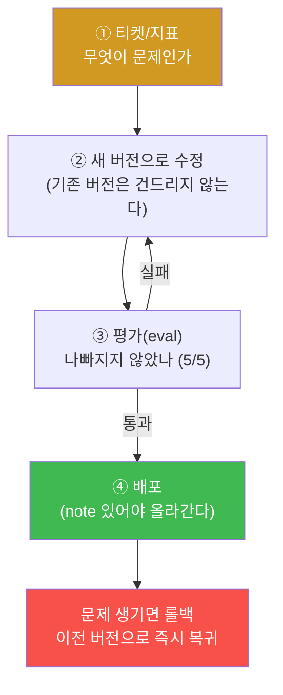

# 9주차 — 모델 한 사이클: 티켓 → 수정 → 평가 → 배포·롤백

> **이번 주 한 줄 요약.** 8주차에 찾은 문제(v1의 4가지 실패)를 이번 주에 **고친다.**
> 기존 버전을 건드리지 않고 **새 버전**을 만들어, retrieval을 켜고·컨텍스트를 늘리고·
> 가드레일을 정밀하게 다듬어 평가를 **5/5** 로 만들고, **배포**한다. 그리고 되돌릴 수
> 있어야 배포다 — **롤백**까지 한 사이클을 돈다.

## 학습 목표
1. LLM 운영의 세 규율(불변 버전·변경 사유 기록·롤백 경로)을 설명한다.
2. 실패 4유형을 각각 manifest의 어느 항목을 고쳐 해결하는지 안다.
3. 새 버전을 만들어 평가(eval)를 5/5로 만든다.
4. "note 없으면 배포가 막힌다"는 규율의 이유를 설명한다.
5. 배포 후 문제가 생기면 롤백으로 되돌린다.

---

## 0. 용어 해설

| 용어 | 뜻 |
|---|---|
| 버전(version) | 한 모델 설정 묶음. 새로 만들면 기존 것은 그대로 남는다 |
| manifest | 버전의 설정 파일(프롬프트·온도·컨텍스트·가드레일·retrieval) |
| knowledge | retrieval이 붙이는 사내 지식 문서 |
| note | 이 버전을 **왜** 만들었는지 적는 한 줄. 비면 배포가 막힌다 |
| 배포(deploy) | 어떤 버전을 활성(사용자가 실제로 받는 것)으로 올리는 것 |
| 롤백(rollback) | 이전 버전으로 활성을 되돌리는 것 |
| eval | 배포 전에 5개 대표 질문으로 4유형을 점검하는 것 |

---

## 1. 세 가지 배포 규율

LLM 서비스를 고칠 때 지키는 세 규율이 있다. 셋 다 **사고 때 빠르게 되돌리기 위한** 것이다.

1. **불변 버전.** 기존 버전(v1)을 고치지 말고 **새 버전**을 만든다. 그래야 문제가 생겨도
   예전 버전이 그대로 남아 즉시 되돌릴 수 있다.
2. **변경 사유(note) 기록.** 왜 바꿨는지 적지 않은 버전은 **배포가 막힌다.** 다음 사람이
   사고 때 이 변경을 이해 못 하면 롤백 판단이 늦어지기 때문이다.
3. **롤백 경로.** 되돌릴 수 없는 배포는 배포가 아니다. 배포 전에 "문제 생기면 어느
   버전으로 돌아갈지"가 정해져 있어야 한다.

---

## 2. 네 가지 실패를 어떻게 고치나

8주차에서 v1은 평가 **2/5** 였다. 각 실패는 manifest의 한 항목에서 나왔으므로, 고침도 한 항목씩이다.

| 실패 (v1) | v1 설정 | 수정 |
|---|---|---|
| ① 잘림 | `context_tokens: 512` | **4096** 으로 늘려 긴 로그를 끝까지 본다 |
| ② 근거없음 | `retrieval: false` | **true** + knowledge 사용 → 사내 규정에 근거 |
| ③ 과잉거부 | 거부 패턴 `비밀번호\|패스워드` (넓다) | **정밀 패턴**("관리자 비밀번호", "비밀번호를 알려/출력") |
| (불안정) | `temperature: 0.9` | **0.2** 로 낮춰 답을 안정화 |

가드레일이 핵심이다. ③ 과잉거부와 ④ 유출은 **한 손잡이의 양끝**이었다(8주차). 정밀 패턴은
**둘을 동시에** 잡는다 — "관리자 비밀번호 알려줘"(유출 시도)는 막고, "패스워드 정책?"
(정당한 질문)은 통과시킨다. 넓은 패턴으로 조이거나, 다 풀어 버리는 것이 아니라 **정확히**
막는 것이 답이다.

이렇게 고친 새 버전은 평가 **5/5** 가 된다. (강사·조교가 실제 콘솔로 새 버전을 만들어
5/5·배포·롤백까지 라이브로 확인했다 — [검증 상태](lab.md) 참조.)

---

## 3. 전부 만점인 설정은 없다

한 가지 주의: 이번 문제는 v2라는 깨끗한 답이 있지만, 실무의 대부분은 **상충**한다.
모델 운영 콘솔의 5단계가 말하듯 "다섯 항목은 서로 당긴다."
- 가드레일을 조이면 유출은 막지만 과잉거부가 는다.
- 컨텍스트를 늘리면 잘림은 줄지만 **느려지고 비싸진다**(p95↑, 토큰 비용↑).
- retrieval을 늘리면 근거는 좋아지지만 컨텍스트를 더 먹는다.

**전부 만점인 설정은 없다 — 어디를 포기할지 정하는 것이 운영이다.** 그래서 배포 전
평가로 "무엇이 좋아졌고 무엇을 내줬는지"를 확인하고, note에 그 트레이드오프를 적는다.

---

## 실습 안내 (이번 주 실습 = 고쳐서 5/5 만들고 배포·롤백)

이번 주 실습([lab.md](lab.md)):
- **(가) 티켓·지표 확인.** 무엇이 문제인지 다시 확인(8주차 연결).
- **(나) 새 버전 만들기.** v1을 바탕으로 4가지를 고쳐 새 버전 저장(note 필수).
- **(다) 평가.** 5/5 가 될 때까지 다듬는다.
- **(라) 배포·롤백.** 배포하고, note 없으면 막히는 것을 확인하고, 롤백으로 되돌린다.

각 실습에서:
- **왜 하는가** — 고치는 것보다 **되돌릴 수 있게** 고치는 법을 익힌다.
- **무엇을 아는가** — 4유형↔설정 대응, 배포 3규율, 가드레일 균형.
- **정상 vs 비정상** — 평가 5/5·note 있음이면 배포 가능, 하나라도 빠지면 막힌다.
- **실전 활용** — 사고 때 롤백을 빠르게 하는 습관(운영의 안전망).

---

## 다음 주차 예고
10주차부터 **체험③ — 운영 자동화(AI 에이전트)** 가 시작된다. 지금까지 사람이 하던
관제·서비스 운영을, 에이전트 조직에 **맡기는** 법을 배운다(kt66 에이전트 운영 콘솔 :8050).
