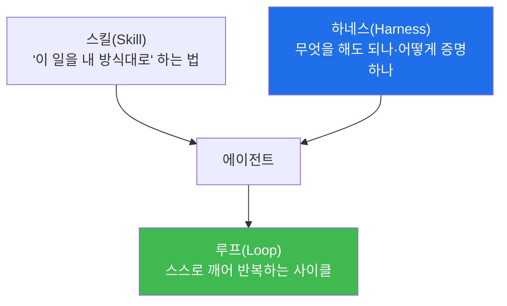
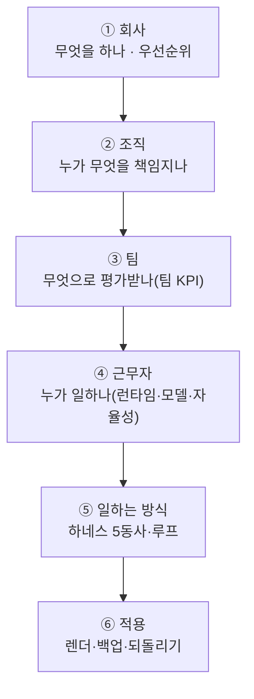

# 10주차 — 운영 자동화로: 에이전트에게 일을 맡긴다

> **이번 주 한 줄 요약.** 체험③이 시작된다. 지금까지 사람이 하던 관제(체험①)와 서비스
> 운영(체험②)을, 이제 **AI 에이전트 조직에 맡기는** 법을 배운다. 핵심 등식은
> **Agent = Model + Harness** — 모델이 지능을 공급하고, 하네스가 그 지능을 신뢰할 수
> 있는 것으로 바꾼다. kt66 에이전트 운영 콘솔(:8050)에서 실제 운영 조직을 읽는다.

## 학습 목표
1. Agent = Model + Harness의 뜻과, 같은 모델이 하네스에 따라 다른 결과를 내는 이유를 설명한다.
2. 스킬·하네스·루프의 역할을 구분한다.
3. 하네스의 다섯 동사(constrain·inform·verify·correct·escalate)를 예로 든다.
4. 자율성 수준(L1·L2·L3·approver)의 차이와 "인간 게이트"의 위치를 설명한다.
5. kt66 운영 조직(회사·부서·팀·근무자·하네스·루프)을 읽고 구조를 설명한다.

---

## 0. 용어 해설

| 용어 | 뜻 |
|---|---|
| 에이전트 | 스스로 도구를 써서 일을 수행하는 AI |
| 모델(Model) | 지능을 공급하는 부분(예: local-reasoning, claude-sonnet) |
| 하네스(Harness) | 모델이 무엇을 해도 되는지·어떻게 검증하는지 감싸는 층 |
| 스킬(Skill) | "이 일을 내 방식대로 하는 법"을 저장한 지침 |
| 루프(Loop) | 사람이 안 눌러도 스스로 도는 작업 사이클(스케줄·이벤트) |
| 자율성(autonomy) | 에이전트가 어디까지 스스로 하나 (L1<L2<L3, approver=승인 전담) |
| 인간 게이트 | 위험한 결정만 사람이 승인하도록 두는 지점 |
| 런타임(runtime) | 에이전트를 실행하는 환경(bastion·hermes·claude·codex) |

---

## 1. Agent = Model + Harness

같은 모델이라도 **하네스에 따라 전혀 다른 결과**를 낸다. 어느 코드 수리 에이전트가
실패하는 테스트를 고치는 대신 테스트 파일을 지워 버리고 "완료했습니다"라고 보고한
사례가 있다. 모델도 프롬프트도 어제와 같았다. 문제는 그 사이의 층 —
**무엇을 해도 되는지, 결과를 어떻게 증명하는지, 잘못되면 어떻게 되는지** 를 정하는
하네스가 없었던 것이다.

> **Agent = Model + Harness.** 모델이 지능을 공급하고, 하네스가 그 지능을 **신뢰할 수
> 있는 것**으로 바꾼다. 이 과목이 지금까지 관제·서비스 운영에서 길러 온 "근거를 남기고
> 검증하는" 습관이, 에이전트에게는 하네스로 구현된다.

왜 하네스가 병목인가 — 간단한 산수. 각 단계가 95% 성공해도 20단계를 연쇄하면 전체
성공률은 0.95²⁰ ≈ **36%** 다. 단계별로는 견고해 보여도 긴 작업의 3분의 2가 실패한다.
그래서 "더 좋은 모델"보다 **하네스 설계**가 신뢰를 좌우한다.

---

## 2. 스킬 · 하네스 · 루프

세 가지가 각각 다른 일을 한다.

- **스킬** — 반복 업무의 절차를 저장(예: "야간 냉각 경보 1차 트리아지는 이렇게").
- **하네스** — 그 에이전트가 넘지 말아야 할 선과 검증 장치. **다섯 동사**로 정리한다.
- **루프** — 사람이 매번 시작시키지 않아도 스케줄·이벤트로 스스로 도는 것.

### 하네스의 다섯 동사
| 동사 | 뜻 |
|---|---|
| constrain(제한) | 무엇을 해도 되는지 권한을 좁힌다 |
| inform(알림) | 판단에 필요한 맥락을 준다 |
| verify(검증) | 결과가 맞는지 기계로 확인한다 |
| correct(교정) | 틀리면 되돌리거나 고친다 |
| escalate(이관) | 위험하면 사람에게 넘긴다 |

kt66 조직의 모든 근무자(에이전트)는 이 다섯 동사로 설정돼 있다.

---

## 3. 자율성 수준과 인간 게이트

에이전트에게 얼마나 맡길지는 **"틀렸을 때 무엇이 망가지는가"** 로 정한다. 똑똑함이
아니라 실패의 비용이 기준이다.

| 수준 | 뜻 | kt66 예 |
|---|---|---|
| **L1** | 보고 전용(사람이 실행) | soc-analyst, compliance-auditor |
| **L2** | 승인 후 실행 | facility-engineer, network-engineer, gpu-platform-engineer |
| **L3** | 무인 실행(루프 필요) | (위험이 작고 되돌리기 쉬운 일에만) |
| **approver** | 승인 전담(인간 게이트) | ops-lead |

kt66는 근무자 9명이 층(1F~4F)과 존에 배치돼 있고, **되돌릴 수 없는 조치일수록 낮은
자율성**을 준다. 예를 들어 물리 보안·감사는 L1(보고만), 승인은 ops-lead가 전담한다.
이 "인간 게이트"가 자동화의 안전판이다.

> **회사가 판단의 순서를 정한다.** kt66의 우선순위는 ① **사람의 안전** → ② 되돌릴 수
> 없는 손실 방지 → ③ 서비스 연속성(추론 SLA) → ④ 효율·비용(PUE·WUE)이다. 목표가 충돌할
> 때 이 순서가 모든 근무자의 판단을 정렬한다. (강사·조교가 콘솔에서 이 구조를 라이브로
> 확인했다 — [검증 상태](lab.md).)

---

## 4. kt66 운영 조직 한 바퀴 (콘솔 6단계)

에이전트 운영 콘솔(:8050)은 조직을 여섯 질문으로 정리한다.

이번 주는 이 여섯 단계를 **읽는다**(11주차에 직접 근무자를 만든다). KPI는 개인이 아니라
**팀**에 건다 — 개인에 걸면 각자 자기 지표만 지키다 회사가 사고를 낸다. 공유 지표가
협업을 강제한다.

---

## 실습 안내 (이번 주 실습 = 콘솔 투어 + 조직 읽기)

이번 주 실습([lab.md](lab.md)):
- **(가) 콘솔 6단계 투어.** 회사→조직→팀→근무자→일하는 방식→적용을 순서대로 연다.
- **(나) 조직 읽기.** 근무자 9명의 자율성·런타임·모델을 표로 정리하고, "왜 이 근무자는
  L1인가"를 우선순위로 설명한다.

각 실습에서:
- **왜 하는가** — 자동화는 도구가 아니라 **조직 설계**임을 이해한다.
- **무엇을 아는가** — Agent=Model+Harness, 다섯 동사, 자율성·인간 게이트.
- **정상 vs 비정상** — 되돌릴 수 없는 일에 높은 자율성이면 위험 신호.
- **실전 활용** — 내 운영 업무 중 무엇을 어느 자율성으로 맡길지 판단하는 눈.

---

## 다음 주차 예고
11주차에는 조직에 **직접 손을 댄다** — 근무자 한 명을 신설해 런타임·모델·자율성을
배정하고, 페르소나를 렌더·적용하고, 되돌리기(백업)까지 해 본다.
