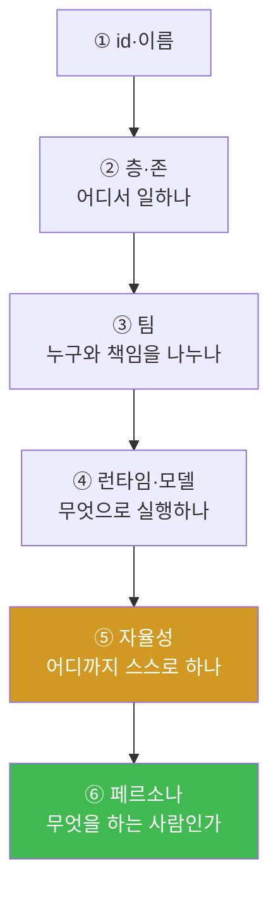
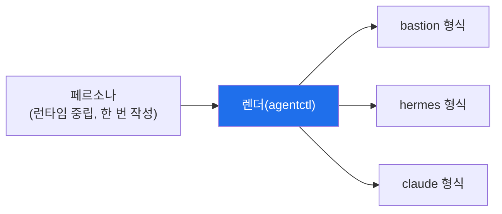

# 11주차 — 조직에 손대기: 근무자 신설·자율성 배정·렌더·되돌리기

> **이번 주 한 줄 요약.** 10주차에 조직을 읽었다면, 이번 주는 **직접 손을 댄다.**
> 근무자 한 명을 신설해 런타임·모델·**자율성**을 배정하고, 페르소나를 **렌더**해 실제로
> 적용하고, **되돌리기(백업)** 까지 한 사이클을 돈다. 자동화도 결국 "되돌릴 수 있게"
> 바꾸는 것이 핵심이다.

## 학습 목표
1. 근무자를 신설할 때 정해야 하는 것(층·존·팀·런타임·모델·자율성)을 안다.
2. "틀렸을 때 무엇이 망가지는가" 기준으로 자율성(L1/L2/L3/approver)을 배정한다.
3. 근무자가 반드시 **팀에 속해야** 하는 이유(책임의 공백 방지)를 설명한다.
4. 페르소나를 렌더해야 비로소 적용된다는 것을 이해한다.
5. 모든 조작에 **되돌리기 경로(백업)** 가 있어야 함을 실천한다.

---

## 0. 용어 해설

| 용어 | 뜻 |
|---|---|
| 근무자(worker) | 조직에 배치된 하나의 에이전트(역할) |
| 페르소나(persona) | 그 근무자가 누구인지·무엇을 하는지 적은 문서 |
| 렌더(render) | 페르소나를 각 런타임 형식으로 변환해 **실제 적용**하는 것 |
| 백업/되돌리기 | 저장할 때마다 남는 이전 상태. 잘못되면 복원 |
| 조직 정합성 | 근무자·팀·페르소나가 서로 어긋나지 않는 상태 |

---

## 1. 근무자를 신설할 때 정하는 것

근무자 한 명을 만들려면 여섯 가지를 정한다.

이 중 **⑤ 자율성**이 가장 중요한 판단이다. 그리고 **③ 팀**에는 규칙이 하나 있다 —
**근무자는 반드시 어느 팀에 속해야 한다.** 팀 없는 근무자는 조직 정합성 오류로 **신설
자체가 거부된다.** 왜냐하면 팀 없는 역할은 사고 때 책임의 공백을 만들기 때문이다
(실제로 콘솔에서 팀 없이 만들면 "어느 팀에도 속하지 않는다"고 막힌다 — 강사·조교가
라이브로 확인했다, [검증 상태](lab.md)).

---

## 2. 자율성 배정 — "틀렸을 때 무엇이 망가지는가"

10주차의 원칙을 이제 **적용**한다. 새 근무자에게 자율성을 줄 때 묻는다:

| 물음 | → 자율성 |
|---|---|
| 이 일이 틀리면 되돌릴 수 없는 손실이 나나? | 낮게(L1 보고 전용) |
| 사람이 승인하면 실행해도 되나? | L2(승인 후 실행) |
| 위험이 작고 되돌리기 쉬운 반복 일인가? | L3(무인, 루프 필요) |
| 이 사람은 승인만 하나? | approver(인간 게이트) |

예를 들어 "야간 냉각 경보 1차 트리아지"를 맡을 근무자를 새로 만든다면 — 관측·보고는
안전하니 **L1**로 시작하고, 신뢰가 쌓이면 승인 후 실행(L2)로 **승격**한다. 처음부터
무인(L3)으로 두지 않는다. **낮게 시작해 올린다** 가 자동화의 안전한 순서다.

---

## 3. 렌더 — 여기까지 와야 적용된 것이다

근무자를 만들고 페르소나를 쓴 것만으로는 아무 일도 일어나지 않는다. **렌더**를 해야
페르소나가 각 런타임(bastion·hermes·claude…) 형식으로 변환되어 실제로 적용된다.

페르소나는 **런타임 중립으로 한 번** 쓰고, 어댑터가 각 런타임 형식으로 렌더한다. 그래서
같은 역할을 여러 런타임에서 일관되게 굴릴 수 있다.

---

## 4. 되돌리기 — 조작에는 항상 복원 경로가 있어야 한다

이 콘솔의 설계 원칙: **되돌리기 경로 없는 조작을 학생에게 시키지 않는다.** 그래서
- 저장할 때마다 **백업**이 남는다(⑥ 적용 탭에서 확인·복원).
- 근무자를 삭제해도 **페르소나 파일은 남긴다**(다시 넣을 수 있게).
- 잘못 만들었으면 삭제·복원으로 조직을 원래대로 되돌린다.

9주차의 "롤백"과 같은 정신이다 — **되돌릴 수 없는 변경은 하지 않는다.** 강사·조교가
근무자를 신설→렌더→삭제해 조직을 원래 9명으로 **완전히 복원**하는 것까지 라이브로
확인했다([검증 상태](lab.md)).

---

## 실습 안내 (이번 주 실습 = 근무자 신설·렌더·되돌리기)

이번 주 실습([lab.md](lab.md)):
- **(가) 근무자 신설.** 새 역할 하나를 만든다(팀 배정 필수, 자율성은 L1부터).
- **(나) 렌더·적용.** 페르소나를 렌더해 실제로 반영한다.
- **(다) 되돌리기.** 백업을 확인하고, 만든 근무자를 삭제해 조직을 원래대로 복원한다.

각 실습에서:
- **왜 하는가** — 조직을 바꾸되 **되돌릴 수 있게** 바꾸는 법을 익힌다.
- **무엇을 아는가** — 신설 6요소, 자율성 배정, 렌더의 의미, 백업.
- **정상 vs 비정상** — 팀 없는 근무자·되돌리기 없는 조작은 거부/위험 신호.
- **실전 활용** — "낮게 시작해 승격" + "항상 복원 경로"라는 자동화 운영 습관.

---

## 다음 주차 예고
12주차는 지금까지의 세 체험(관제·서비스 운영·자동화)에서 내린 **판단들을 한자리에서
비교**한다 — "무엇을 지키고 그 대가가 무엇인가"라는 이 과목의 관통 질문으로. 통합
구간(13~15주)으로 넘어가는 다리다.
