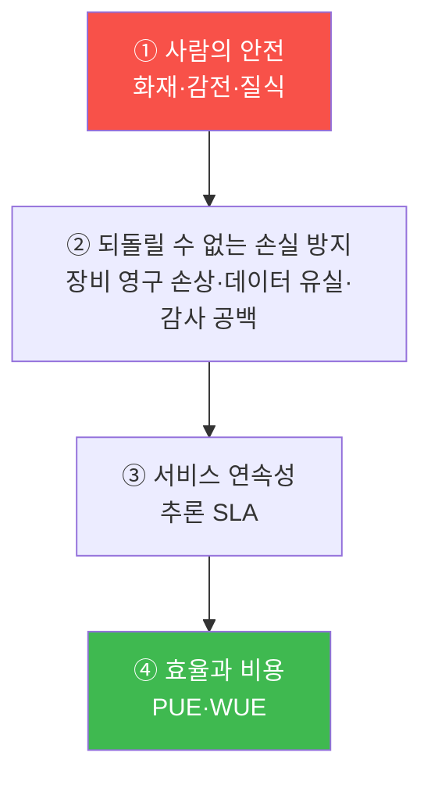

# 12주차 — 운영자의 판단: 무엇을 지키고, 그 대가는 무엇인가

> **이번 주 한 줄 요약.** 새 도구는 없다. 지금까지 세 무대(시설 관제·서비스 운영·운영
> 자동화)에서 내린 판단들을 **한자리에 모아 비교**한다. 세 영역이 전혀 달라 보여도, 판단의
> **형태는 하나**다 — "무엇을 지키기로 했고, 그 대가가 무엇인가." 이 과목 전체를 관통하는
> 질문을 정면으로 다루고, 통합 구간(13~15주)으로 넘어가는 다리다.

## 학습 목표
1. 세 영역의 대표 판단을 "지킨 것 / 버린 것 / 대가"의 공통 틀로 정리한다.
2. 트레이드오프에는 정답이 하나가 아님을, 그러나 **근거는 있어야** 함을 설명한다.
3. 회사 우선순위가 목표 충돌 시 판단을 정렬함을 세 영역에 적용한다.
4. 자신이 각 체험에서 내린 판단을 이 틀로 다시 써 본다.

---

## 1. 세 무대, 하나의 판단 형태

지금까지의 판단들을 나란히 놓으면 같은 골격이 보인다. (아래 값은 콘솔에서 라이브로
확인한 현재 값이다 — [검증 상태](lab.md).)

| 무대 | 상황 | 지킨 것 | 버린 것(대가) |
|---|---|---|---|
| **시설 관제**(6주) | 냉각탑 정지, 축열 버퍼 20분 (ENV-CT-01, SLA 탐지 3분·조치 18분) | 추론 SLA | GPU **학습 job 중단**(학습 지연) |
| **서비스 운영**(9주) | 가드레일 조이기 vs 풀기 | 유출 차단 | 넓게 조이면 **과잉거부**(정상 질문 막힘) |
| " | 컨텍스트 늘리기 | 잘림 방지 | **느려지고 비싸짐**(p95↑·토큰↑) |
| **운영 자동화**(11주) | 새 근무자 자율성 | 안전(되돌리기 가능) | L1로 시작 → **속도 포기**(사람이 실행) |

세 상황은 도메인이 다르지만 **판단의 문장은 똑같다**:
> "나는 ___ 을 지키기로 했고, 그 대가로 ___ 을 내줬다. 왜냐하면 ___."

이것이 이 과목이 처음부터(1주차 "무엇을 지키고 그 대가가 무엇인지 말할 수 있으면 된다")
끝까지 요구해 온 단 하나의 능력이다.

---

## 2. 정답은 하나가 아니다 — 그러나 근거는 있어야 한다

트레이드오프에는 "무조건 옳은" 설정이 없다.
- 가드레일을 얼마나 조일지, 컨텍스트를 얼마나 늘릴지, 부하를 어디까지 끊을지, 자율성을
  얼마나 줄지 — 전부 **상황이 정한다.**
- 그래서 채점도 "무엇을 했는가"가 아니라 **"근거를 남겼는가"** 를 봤다(시설 시나리오,
  모델 배포 note, 근무자 자율성 판단 모두).

> **핵심.** 운영자는 정답을 아는 사람이 아니라, **트레이드오프를 보고 근거로 선택하고,
> 되돌릴 수 있게 실행하는** 사람이다.

---

## 3. 충돌하면 우선순위로 정렬한다

목표가 서로 당길 때(추론 SLA vs 효율, 유출 차단 vs 과잉거부, 속도 vs 안전), 무엇을
먼저 둘지는 **회사 우선순위**가 정한다. kt66의 순서(라이브 확인):

이 순서로 세 판단을 다시 읽으면 일관된다.
- 냉각탑 정지에서 **학습(효율)을 버리고 추론(연속성)을 지킨** 것 → ③ > ④.
- 정전에서 결국 **사람이 먼저**(대피) → ①이 모든 것 위에.
- 자동화에서 **되돌릴 수 없는 일에 낮은 자율성** → ②를 지키려는 것.

**같은 우선순위가 세 무대를 관통한다.** 이것이 "한 데이터센터를 운영한다"는 말의 뜻이다 —
시설·서비스·자동화가 **하나의 판단 체계** 아래 움직인다.

---

## 실습 안내 (이번 주 실습 = 내 판단을 다시 쓰기 · 비교 워크숍)

이번 주 실습([lab.md](lab.md))은 시스템 조작이 아니라 **판단 워크숍**이다.
- **(가) 내 판단 3개 모으기.** 5~11주에 내가 남긴 판단 기록에서 세 영역 각 1개씩 가져온다.
- **(나) 공통 틀로 다시 쓰기.** "지킨 것 / 버린 것(대가) / 근거 / 우선순위 어디에 걸리나"로 정리.
- **(다) 조별 비교·토론.** 같은 상황에 다른 선택을 한 사례를 찾아, **누가 더 나은가가 아니라
  각자의 대가가 무엇인지**를 비교한다.

각 실습에서:
- **왜 하는가** — 흩어진 체험을 하나의 판단 능력으로 통합한다.
- **무엇을 아는가** — 세 영역이 같은 판단 골격·같은 우선순위를 공유함.
- **정상 vs 비정상** — "대가를 말할 수 있으면" 좋은 판단, "정답이라고만 하면" 아직 부족.
- **실전 활용** — 캡스톤(13~15주)에서 여러 판단을 동시에 내릴 때의 기준.

---

## 다음 주차 예고
13주차부터 **통합 구간**이다 — 시설 장애와 서비스 트래픽을 **동시에** 겪는 미니 통합
훈련(13주)과 팀별 미니 캡스톤(14주), 최종 발표(15주). 지금까지 나눠서 배운 것을 한
데이터센터 위에서 함께 굴린다.
