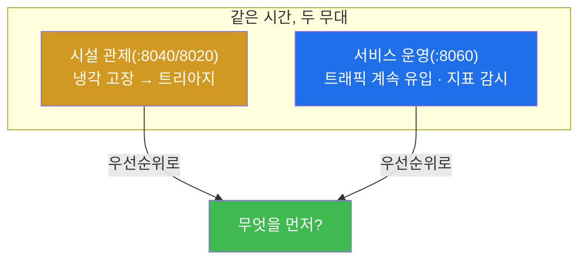

# 13주차 — 미니 통합: 시설 장애와 서비스 트래픽을 동시에

> **이번 주 한 줄 요약.** 통합 구간이 시작된다. 지금까지 나눠서 배운 것을 **한 데이터센터
> 위에서 함께** 굴린다. 냉각 고장이 나서 관제하는 **그 시간에도** 사내 LLM 서비스는 계속
> 트래픽을 받는다. 두 무대를 **동시에** 운영하며, 무엇을 먼저 볼지 우선순위로 판단한다.

## 학습 목표
1. 시설 관제와 서비스 운영을 동시에 진행하며 상황을 유지한다.
2. 여러 일이 겹칠 때 회사 우선순위로 처리 순서를 정한다.
3. 한 무대에 매몰되지 않고 다른 무대의 지표를 주기적으로 확인한다.
4. 동시 운영에서도 각 판단에 근거(무엇을 지키고 버렸나)를 남긴다.

---

## 1. 현실의 운영은 한 번에 하나가 아니다

지금까지는 한 번에 한 무대였다 — 시설 고장이면 관제만, 서비스 티켓이면 LLMOps만.
현실은 다르다. **냉각 경보가 뜬 그 순간에도 사내 챗봇은 질문을 받고 있고, 개발자는 긴
로그 분석을 요청하고, 외부에서 이상한 프롬프트가 들어온다.** 운영자는 이 둘을 **동시에**
쥐고 있어야 한다.

강사·조교가 실제로 **시설 고장에 100/100로 대응하는 동안 서비스 트래픽이 계속 흐르는
것**을 라이브로 확인했다([검증 상태](lab.md)).

---

## 2. 무엇을 먼저 볼 것인가 — 우선순위로 정렬

두 무대가 동시에 무언가를 요구할 때, 12주차의 우선순위가 처리 순서를 정한다.

| 상황 | 우선순위 판단 |
|---|---|
| 냉각 고장으로 **온도가 위험** vs 챗봇 지연 약간↑ | 온도(②·③) 먼저 — 되돌릴 수 없는 손상·서비스 중단 위험 |
| 냉각은 **버퍼 안(안정)** vs 서비스 **유출 시도 급증** | 유출(②) 먼저 — 되돌릴 수 없는 손실 |
| 둘 다 경미 | 정해진 SLA가 급한 쪽부터 |

핵심은 **한 무대에 매몰되지 않는 것**이다. 냉각 트리아지에 빠져 있는 사이 서비스 지표가
망가지고 있을 수 있다. 그래서 **주기적으로 다른 무대를 훑는** 습관이 필요하다 — 관제
중에도 서비스 지표(ok_rate·실패 카운트)를 이따금 확인한다.

---

## 3. 동시 운영에서도 근거는 남긴다

바빠도 판단 기록은 남긴다. "온도가 급해서 서비스 지연을 잠시 감수했다 — 대가는 챗봇
p95 상승, 근거는 되돌릴 수 없는 장비 손상 방지"처럼. 동시 운영이라고 근거가 면제되지
않는다. 오히려 겹칠수록 **왜 이걸 먼저 했는지** 가 나중에 중요해진다.

> **이번 주 메시지.** 통합 운영은 새로운 기술이 아니라, 지금까지의 판단을 **동시에·번갈아**
> 적용하는 것이다. 무대는 둘이어도 판단의 문장은 하나다.

---

## 실습 안내 (이번 주 실습 = 두 무대 동시 운영)

이번 주 실습([lab.md](lab.md)):
- **(가) 동시 운영.** 강사가 시설 고장을 발사하는 **동시에** 서비스 트래픽이 흐른다.
  학생은 시설을 트리아지(보고·제출)하면서 **틈틈이 서비스 지표를 확인**한다.
- **(나) 우선순위 로그.** "이 순간 무엇을 먼저 봤고, 왜"를 짧게 기록한다.

각 실습에서:
- **왜 하는가** — 현실의 운영은 동시다발임을 체감한다.
- **무엇을 아는가** — 우선순위로 처리 순서를 정하고, 무대 전환을 관리하는 법.
- **정상 vs 비정상** — 한 무대에 매몰돼 다른 무대를 놓치면 위험 신호.
- **실전 활용** — 14주 미니 캡스톤(팀 운영)의 예행.

---

## 다음 주차 예고
14주차는 **미니 캡스톤** — 팀을 이뤄 짧은 운영 시나리오를 처음부터 끝까지 수행하고,
판단 로그를 정리해 15주 발표를 준비한다.
